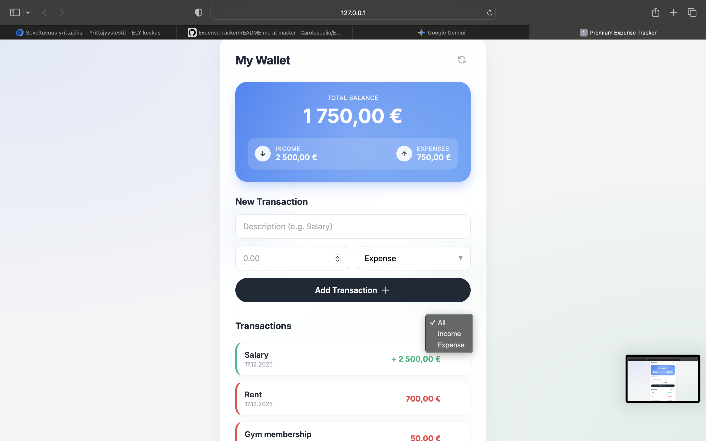

A modern, high-fidelity expense tracking web application featuring a "Glassmorphism" UI design. This application allows users to track income and expenses with a professional fintech-inspired interface.


*(Note: Replace 'preview.png' with a screenshot of your app once you run it!)*

## ✨ Features

- **Modern UI/UX:** Clean, premium aesthetic using glassmorphism, soft shadows, and smooth CSS animations.
- **Transaction Management:** Add income and expenses with descriptions and amounts.
- **Real-time Calculations:** Automatically updates Total Balance, Total Income, and Total Expenses.
- **Data Persistence:** Uses LocalStorage to save your transactions even after refreshing the browser.
- **Filtering:** Filter transactions by "All", "Income", or "Expense".
- **Responsive Design:** Fully optimized for desktop and mobile devices.
- **Formatted Currency:** automatic Euro formatting (e.g., `1 250,00 €`).

## 🛠️ Tech Stack

- **HTML5:** Semantic structure.
- **CSS3:** Flexbox, CSS Variables, Keyframe Animations, Backdrop Filter.
- **JavaScript (ES6+):** DOM manipulation, Event handling, LocalStorage API, Intl.NumberFormat.

## 🚀 How to Run

No installation or build steps required. This is a pure Vanilla JS project.

1. **Clone or Download** this repository.
2. Navigate to the project folder.
3. Open `index.html` in your web browser (Chrome, Firefox, Safari, etc.).

## 📂 Project Structure

```text
/expense-tracker
│
├── index.html    # The main structure
├── style.css     # Styling, animations, and responsive design
├── script.js     # Logic, state management, and DOM updates
└── README.md     # Project documentation